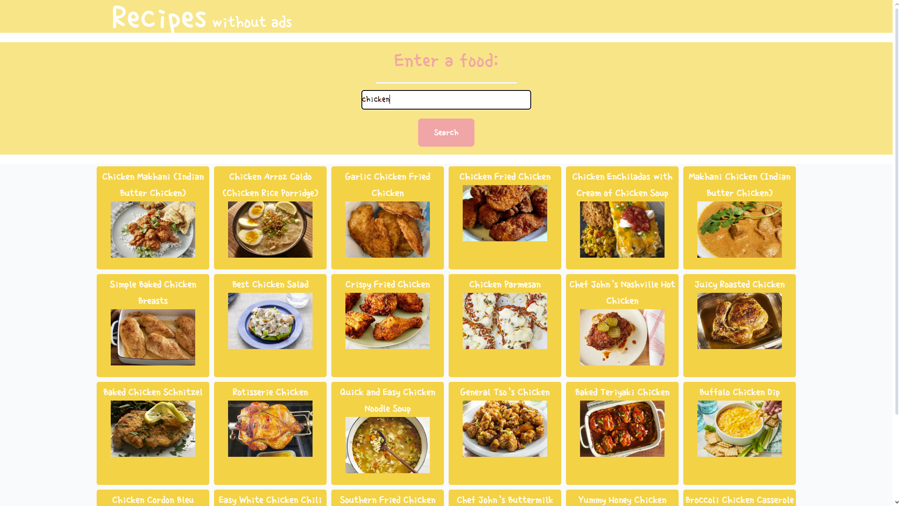

# Recipe Without Ads
  
  ## Description

This application solved a real-world issue of mine: recipe websites are not designed for mobile and are full of clutter and ads. I attempted to find the cook time for airfrying chicken breast, but it took me 5 minutes to get through the site. So my webapp has a react front end with tailwind for style and Redux advanced state management and a springboot backend that works with webscraping. Deployment handled with AWS elastic beanstalk and S3 bucket.

  ## Table of Contents 

  [Description](#description)

  [Usage](#usage)

  [Credits](#credits)

  [Questions](#questions)

  ## Usage

    Link: 
    http://recipe-without-ads.s3-website.us-east-2.amazonaws.com 
    
    
  
  ## Credits
  
  Solo project

  Github project link: 
    https://github.com/nathansabin/recipes-without-ads

  ## Questions

  Github:
  https://github.com/nathansabin

  email:
  sabinnat001@outlook.com